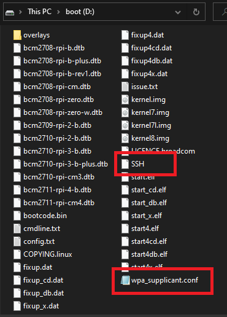

# AWS IoT Greengrass on a Raspberry Pi Zero
Goal is to install [AWS IoT Greengrass](https://docs.aws.amazon.com/greengrass/latest/developerguide/quick-start.html) on a headless Raspberry Pi Zero W and deploy a local lambda to control Home-assistant

## Hardware
* Raspberry Pi Zero W<br/>
* Micro SD Card<br/>
* Micro USB power<br/>

## Raspberry Pi Setup 
Download latest [Raspberry PI OS](https://downloads.raspberrypi.org/raspios_lite_armhf_latest) image<br/>
Use [Etcher](https://www.balena.io/etcher/) to flash the image to your SD Card<br/>
File explore to your SD card and create an empty file named: SSH<br/>
Using a text editor, create a file named: wpa_supplicant.conf, paste the text below, correct your WIFI credentials
and copy the file to your SD card<br/>
```
country=US
ctrl_interface=DIR=/var/run/wpa_supplicant GROUP=netdev
update_config=1
network={
	ssid="<your-ssid>"
	psk="<your wifi-password>"
	key_mgmt=WPA-PSK
}
```
Your SD Card should look like this<br/>
<br/>
Insert the SD Card in your Rpi Zero and boot<br/>
Find the IP of your Rpi Zero<br/>
Use [Putty](https://www.chiark.greenend.org.uk/~sgtatham/putty/latest.html) to SSH to your Rpi Zero<br/>
Accept the security warning<br/>
Login with the default Raspbian user: pi and password: raspberry<br/>

Run the Raspberry configuration tool
```
sudo raspi-config
```
Change the following parameters:<br/>
* Change user password
* Network options | Change Hostname
* Localisation Options | Change Time Zone
* Advanced Options | Expand Filesystem
* Advanced Options | Change Memory split to 16
Reboot
```
sudo reboot
```
SSH back to your Rpi Zero, login with user: pi and your new password<br/>
Run update and upgrade
```
sudo apt-get update
sudo apt-get upgrade -y
```
## AWS Greengrass core requirements ([reference](https://docs.aws.amazon.com/greengrass/latest/developerguide/setup-filter.rpi.html))
SSH back your RPI Zero and add Greengrass core user and group
```
sudo adduser --system ggc_user
sudo addgroup --system ggc_group
```
Edit file 98-rpi.conf
```
cd /etc/sysctl.d
sudo nano 98-rpi.conf
```
Append to end of the file
```
fs.protected_hardlinks = 1
fs.protected_symlinks = 1
```
Reboot
```
sudo reboot
```
Edit cmdline.txt
```
cd /boot/
sudo nano cmdline.txt
```
append to end of the first line (not as a new line)
```
cgroup_enable=memory cgroup_memory=1
```
Reboot
```
sudo reboot
```
## AWS Greengrass setup ([reference](https://docs.aws.amazon.com/greengrass/latest/developerguide/gg-config.html))
Follow the steps from the reference, to create the AWS IoT Greengrass group and AWS IoT Greengrass core<br/>
Once you complete the steps, download the security resources as a tar.gz file, these are the certificates that you will need in the next step<br/>
Download the greengrass core software for your architecture, in this case [Raspbian Linuz Armv6l](https://d1onfpft10uf5o.cloudfront.net/greengrass-core/downloads/1.11.0/greengrass-linux-armv6l-1.11.0.tar.gz)<br/>
Use [Winscp](https://winscp.net/eng/download.php) to copy the certificates tar.gz file and the core software tar.gz to your Rpi Zero<br/>
On the AWS Console, drill down to AWS IoT > Greengrass > Groups > your group > Settings<br/>
Scroll down to Stream Manager, and set to disabled<br/>

## AWS Greengrass core setup ([reference](https://docs.aws.amazon.com/greengrass/latest/developerguide/gg-device-start.html))
SSH to your RPI Zero and run the commands
```
sudo tar -xzvf greengrass-linux-armv6l-1.11.0.tar.gz /
sudo tar -xzvf xxxxxxx-setup.tar.gz /greengrass
sudo cp ./certs/* ./greengrass/certs
sudo cp .config/* ./greengrass/config
cd greengrass/certs
sudo wget -O root.ca.pem https://www.amazontrust.com/repository/AmazonRootCA1.pem
```
## AWS Greengrass SDK
Navigate to the [Greengrass Core Python SDK](https://github.com/aws/aws-greengrass-core-sdk-python) github page<br/>
Click on the Code menu drop down, and select download zip<br/>
Unzip the file and extract the folder greengrasssdk<br/>
Winscp to your RPI Zero and copy this folder to /greengrass/ggc/core/runtime/python<br/>
In theory this step is not needed, but in my case I had to manually copy the sdk folder and lambda to the RPI Pi Zero
 
## AWS Greengrass lambda
Create lambda<br/>
Configure Greengrass group to use lambda<br/>
Configure Greengrass suscription<br/>
Note: In my case, I had to winscp copy the lambda (including sdk subfolder) to your Pi /greengrass/core/runtime/python<br/>

## AWS Greengrass core start
SSH to your RPI Zero and run the commands
```
sudo cd /greengrass/ggc/core
sudo ./greengrassc start
```

## AWS Greengrass core troubleshooting
```
sudo nano var/log/system/runtime.log
sudo nano var/log/user/us-east-1/114744974534/<your-lambda-name>.log
```


